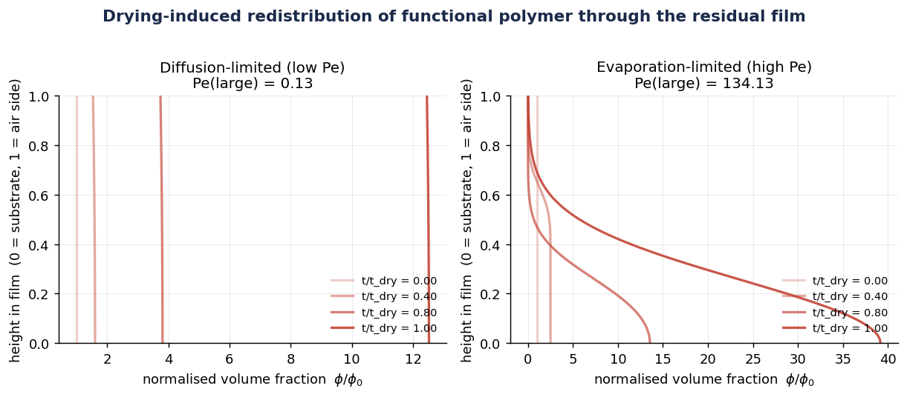
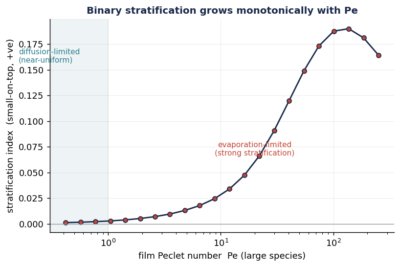
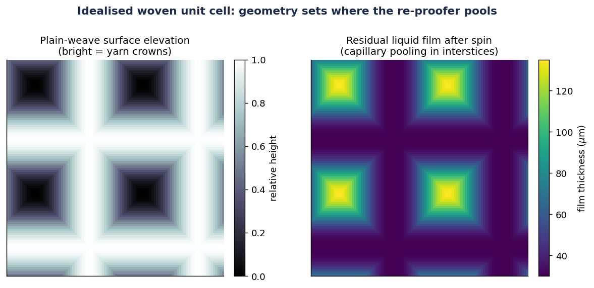
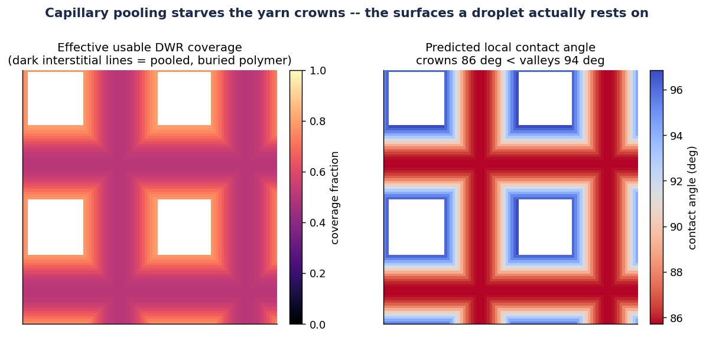
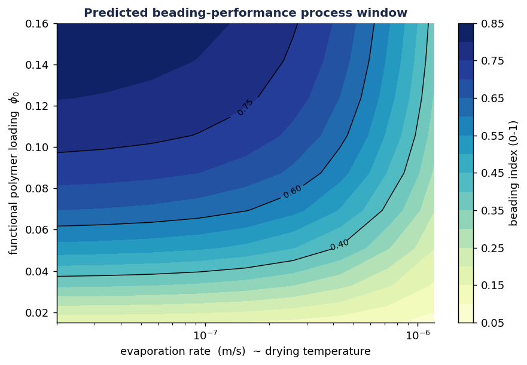
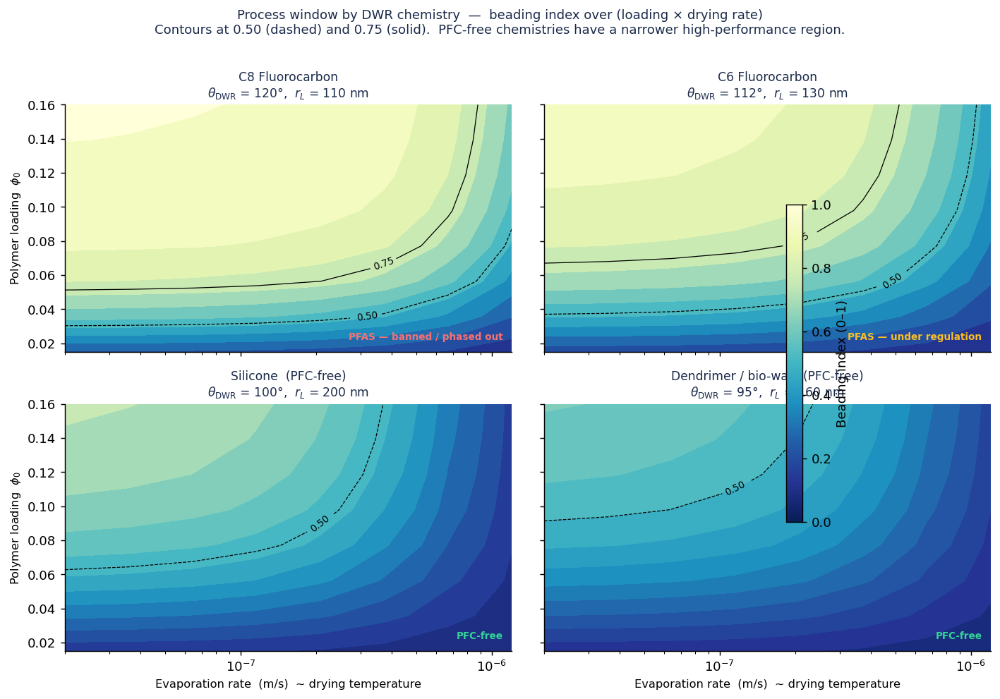
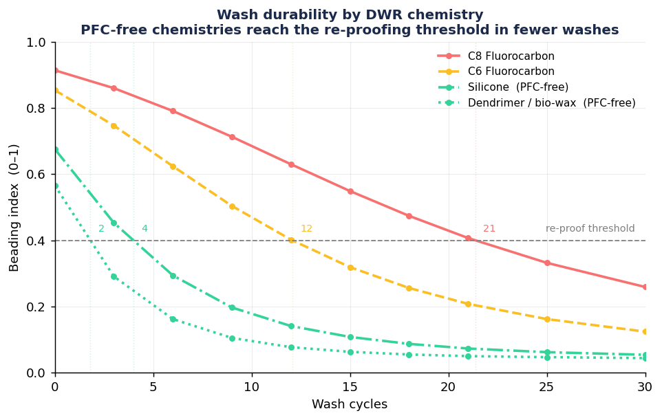

# DWR Re-Proofer Drying & Coating Uniformity Simulator

**[Live dashboard →](https://arthurstubbings.github.io/dwr-sim/)** &nbsp;|&nbsp; **[Technical report (PDF)](report/dwr_sim_report.pdf)**

A physics-based computational model of how a durable-water-repellent (DWR)
wash-in re-treatment dries on a woven textile — from colloidal stratification
in the evaporating film through to predicted water-beading performance across
the unit cell.

**Status:** physics core and textile layer complete; 12/12 tests pass.
All results are *predictions of a computational model* with qualitative
validation against the colloidal-film stratification literature.
No experimental DWR measurements were performed.

| Version | What changed |
|---|---|
| **v1.2** | Wash durability model; per-chemistry degradation curves; live wash slider + sparkline in dashboard; fig7 |
| **v1.1** | DWR chemistry comparison (C8 → C6 → silicone → dendrimer); chemistry selector in dashboard; fig6; parallel sweep |
| **v1.0** | Initial release — 1D drying solver, plain-weave unit cell, interactive dashboard, 5 figures, technical report |

---

## Motivation

Consumer DWR wash-in re-treatments — the kind you'd use to re-proof a worn
jacket — are colloidal dispersions: water-repellent polymer particles suspended
in water alongside a smaller carrier/surfactant phase. After a garment is
washed in the treatment and removed, the water evaporates. As the air–liquid
interface recedes it sweeps particles toward the drying surface; diffusion
opposes this. The competition is governed by the film Péclet number,

```
Pe = v_evap × H₀ / D
```

where `v_evap` is the interface recession velocity, `H₀` the initial film
thickness, and `D` the particle diffusion coefficient. For a *binary*
dispersion the two species have different `D` (size-dependent), so they
stratify differentially — a mechanism well-established in the colloidal-film
literature (Routh/Russel evaporation framework; Fortini et al. binary
stratification).

That drying and redistribution step is also exactly the physics underlying my
MEng dissertation at Loughborough University: *Using Machine Learning to Aid
the Research of Stratification of Binary Colloidal Solutions*. This project
transplants those same governing equations from a flat colloidal film onto a
woven textile, coupling stratification physics to a spatial DWR deposition
model and a predicted water-beading performance index.

The question the model answers:

> *When a DWR re-proofer dries on a jacket, does the polymer deposit
> uniformly, or does it pool in the yarn interstices and starve the fibre
> crowns — and how does that predict real-world water-beading performance?*

---

## The Central Finding

Capillary pressure pulls the re-proofer dispersion into the high-curvature
inter-yarn interstices, leaving a thicker residual film there than on the
exposed yarn crowns. Those locally thicker films have a **higher local Péclet
number**, so the functional polymer is more strongly swept toward the drying
surface and then buried against the yarn rather than remaining as a usable
surface film. The net result:

> **The repellent pools where it isn't needed and starves the yarn crowns —
> the very surfaces a raindrop actually rests on.**

The model identifies a processing window (adequate polymer loading, gentle
drying rate) that mitigates crown starvation by keeping the local Péclet
number low enough for diffusion to re-homogenise the deposit before the film
collapses.

This finding is locked in a test (`test_pooling_starves_crowns`): the model
always predicts crown contact angle < valley contact angle under realistic
consumer re-treatment conditions.

---

## Method

### 1 — Physics core: 1D binary colloid drying (`src/drying_1d.py`)

A DWR film on the textile surface is modelled as a locally 1D evaporating
binary colloidal film. The governing equation uses the conservative
areal-density variable `q = h·φ` on a mapped coordinate `x = z/h(t)` that
transforms the shrinking physical domain `[0, h(t)]` onto a fixed
computational grid `[0, 1]`:

```
∂q/∂t = ∂/∂x[ (D/h²) ∂q/∂x  +  (h'/h)·x·q ]
```

The first term is diffusion with mapped coefficient `D/h²`; the second is the
moving-frame advective concentration that sweeps particles toward the drying
surface and drives stratification. This transformation was **derived and
symbolically verified with sympy** (an earlier formulation that dropped the
advection term was caught in this check — see `test_symbolic_transformation`).

The scheme uses:
- **Conservative finite-volume discretisation** on fixed cell centres —
  `∫q dx` is conserved to linear-solver tolerance (verified to ~1×10⁻¹²).
- **Backward-Euler implicit time stepping** — unconditionally stable, so the
  `D/h²` stiffness that diverges as `h→0` never limits the step size.
- **Stokes–Einstein diffusion** `D = k_B T / (6πμr)` for each species.

### 2 — Textile layer: plain-weave unit cell (`src/weave_cell.py`)

An idealised plain-weave unit cell — two orthogonal families of sinusoidal
yarns in anti-phase — provides the spatial context. This choice is
deliberate: a fibre-resolved micro-CT geometry is a multi-month research
effort; the idealised unit cell is the standard defensible simplification and
captures the one critical effect (capillary pooling in the interstices).

The pipeline:
1. **Geometry** — build height map and capillary film-thickness map over the
   unit cell. Film thickness is thicker in valleys (high Laplace pressure
   drives liquid into the inter-yarn gaps).
2. **Local drying** — evaluate the 1D solver at a small set of representative
   film thicknesses and interpolate. Each point's local Péclet number is set
   by its local film thickness.
3. **Effective coverage** — combine local film thickness, polymer loading, and
   usable-surface fraction (the fraction of functional polymer that ends up at
   the air side of the dried deposit rather than buried).
4. **Contact angle** — a Cassie–Baxter mixing rule between the fully-coated
   and bare-yarn contact angles.
5. **Beading index** — a crown-weighted spatial average of a sigmoid beading
   score, in [0, 1]. This is a **relative** metric for comparing processing
   conditions, not an absolute contact-angle prediction.

---

## Key Results

### Drying profiles: uniform vs. stratified

At low Péclet number, diffusion dominates and the functional polymer remains
near-uniform through the film depth — the deposit on the dried textile is
homogeneous. At high Péclet number, the evaporation-driven advective flux
overwhelms diffusion and strongly concentrates the large species at the top of
the film during drying; the final deposit is strongly stratified.



### Stratification grows monotonically with Péclet number

The stratification index (difference in centre-of-mass height between small
and large species, in units of the final film height) rises continuously from
≈0 at low Pe to >0.18 at high Pe, reproducing the qualitative behaviour
predicted by the Routh/Russel and Fortini frameworks for binary colloidal
films. This is the model's primary qualitative validation target.



### Weave geometry sets the pooling map

The plain-weave unit cell produces a surface elevation with clear crown and
valley structure. The capillary residual-film map shows film thickness
increasing from ~30 µm on the crowns to ~135 µm in the interstices — a
factor of ~4.5, the dominant driver of non-uniform deposition.



### Crown starvation: pooling buries the repellent

At a moderate polymer loading (φ₀ = 0.045), the predicted contact angle is
higher in the valleys than on the crowns — the opposite of what good beading
performance requires. The high-Péclet interstices accumulate polymer but bury
it deep in the deposit; the lower-Péclet crowns dry more uniformly but with
less total material. The spatial contact-angle map makes this visible.



### Process window: concentration and drying rate together determine performance

The beading index over the 2D process space of polymer loading × drying rate
reveals:
- **Too little polymer**: insufficient total deposit regardless of drying
  rate.
- **Too fast / too hot drying**: high Pe everywhere drives burial, degrading
  usable coverage.
- **The sweet spot**: moderate loading (φ₀ ≳ 0.07) combined with slow/cool
  drying (low evaporation rate) gives beading index > 0.75.

This is the model's actionable output for materials development and QA.



### Chemistry comparison: PFC-free process window

Consumer DWR chemistry is under significant regulatory pressure — C8
fluorocarbons are banned in most markets, C6 is under active review, and
the industry is moving toward PFC-free alternatives (silicone dispersions,
dendrimer/bio-wax systems). These chemistries have lower intrinsic contact
angles and larger particle sizes (slower diffusion, higher local Péclet
number at the same drying conditions) — a double penalty.

The four-panel comparison maps the process window for each chemistry class,
showing directly how the high-performance region (beading index > 0.75)
shrinks as you move from legacy fluorinated to PFC-free chemistry. The
dashboard lets you switch between chemistries interactively; the process
window and contact-angle maps update live.



### Wash durability: how many cycles before re-proofing?

Each wash cycle mechanically abrades the DWR coating. Crowns — the exposed
high points that contact other surfaces during tumble-washing — lose coating
faster than the protected valleys. Combined with the chemistry's intrinsic
substrate-bonding strength, this gives a per-chemistry degradation curve: how
the beading index falls with wash count, and at what point re-proofing is
needed (beading index < 0.4).

The result is a **triple penalty** for PFC-free chemistries:
1. Lower intrinsic contact angle (lower performance ceiling)
2. Larger particle size → higher local Péclet number → more burial on crowns
3. Weaker substrate bonding → faster wash degradation

The dashboard wash slider applies degradation live — the coverage and
contact-angle maps update per-pixel, showing crowns bleaching out first.



---

## Validation

All validation is **qualitative** — the model is compared to known
theoretical behaviour of colloidal-film physics, not to experimental DWR
measurements.

| Check | Result |
|---|---|
| Mass conservation (12 Pe regimes, 4 step counts) | Worst error 2.5 × 10⁻¹² |
| Coordinate transformation (sympy symbolic check) | Exact agreement |
| Low-Pe → uniform deposit (SI < 5 × 10⁻³) | PASS |
| High-Pe → small-on-top stratification (SI > 0.12) | PASS |
| SI monotonically increases with Pe | PASS (4 points) |
| Beading rises with polymer concentration | PASS (0.11 → 0.82) |
| Under-loaded dispersion fails to bead (CA < 90°) | PASS |
| Crown CA < valley CA (pooling-starves-crowns) | PASS (86° vs 94°) |
| Beading index in [0,1] and finite | PASS |

The stratification behaviour (small-on-top at high Pe) is consistent with the
theoretical predictions of Routh & Russel's evaporation/Péclet framework and
with Fortini et al.'s binary stratification results. The Cassie–Baxter contact
angle mixing and Stokes–Einstein diffusion are standard, well-established
relations.

---

## Limitations and Future Work

### Limitations of the current model (honest scope for a 1–2 week project)

- **1D drying physics.** The local film is treated as laterally homogeneous;
  lateral flow driven by capillary-pressure gradients (thinning film flowing
  into interstices) is not modelled within the drying step itself — only the
  pooled film thickness at the end of drainage is an input.
- **Idealised geometry.** The sinusoidal plain-weave unit cell captures the
  topology but not the fibre-scale roughness, twist, or crimp geometry of
  real yarns. A fibre-resolved micro-CT model would be the natural extension.
- **Linear-recession evaporation.** Constant evaporative flux is assumed
  (the falling-rate-free period). Real garment drying involves a
  surface-dry transition and through-thickness moisture gradients.
- **No coalescence or film-formation kinetics.** The model predicts where
  polymer *deposits*, not whether it forms a continuous, defect-free film
  (which requires polymer above its minimum film-forming temperature).
- **Beading index is a relative metric.** The [0,1] index correctly ranks
  processing conditions but is not calibrated to a specific contact-angle
  measurement. Absolute contact-angle prediction would require fitting to
  experimental DWR data.
- **Wash durability model is empirical, not mechanistic.** The per-wash
  coverage loss follows a simple exponential decay weighted by local surface
  height (crowns abrade faster). Real wash degradation involves tribological
  contact mechanics, detergent chemistry, textile swelling, and
  temperature-dependent bonding — none of which are modelled. The
  `wash_durability_factor` values and crown abrasion coefficient (1.5×) are
  physically motivated estimates, not fitted parameters. The relative ordering
  of durability (C8 > C6 > silicone > dendrimer) is consistent with
  industry experience, but the absolute wash counts should be treated as
  illustrative rather than predictive.
- **No detergent or re-orientation effects.** Detergents actively displace
  DWR molecules; silicone-based chemistries can partially re-orient or
  reflow between cycles ("self-healing"). Both are ignored.

### Natural extensions

- **Fibre-resolved geometry** from micro-CT, enabling pore-scale film-flow
  simulation.
- **Lateral drainage model** — couple a thin-film lubrication equation to the
  pooling geometry so the initial film-thickness map is derived rather than
  parameterised.
- **Temperature-dependent viscosity and polymer MFT** — tie drying temperature
  explicitly to viscosity, diffusivity, and film-formation threshold.
- **Experimental calibration** — one spray/bead test at two drying temperatures
  would anchor the beading index to real contact-angle data.
- **Mechanistic wash model** — replace the empirical exponential decay with
  a tribology-informed abrasion model, and add detergent-concentration and
  temperature dependence. Calibrate against experimental wash-cycle data.

---

## How to Run

```bash
pip install -r requirements.txt

# Run all tests (should be 12/12 pass, < 5 s)
cd src
python test_drying_1d.py
python test_weave_cell.py

# Regenerate all 7 figures (fig5 ≈ 70 s, fig6 ≈ 120 s, fig7 ≈ 30 s)
python make_figures.py

# Quick smoke test of the physics core
python drying_1d.py

# One-command run-all (from repo root)
python run_all.py
```

---

## Repo Layout

```
src/
  drying_1d.py          1D binary colloid drying solver (physics core)
  weave_cell.py         plain-weave unit cell + beading performance model
                        + ChemistryProfile dataclass + CHEMISTRY_PROFILES
  test_drying_1d.py     6 physics-core tests
  test_weave_cell.py    6 textile-layer tests
  make_figures.py       generates figures/fig1..7
  make_dashboard.py     precomputes 432-run sweep → index.html (GitHub Pages)
figures/
  fig1_drying_profiles.png
  fig2_stratification_map.png
  fig3_unit_cell.png
  fig4_deposition.png
  fig5_process_window.png
  fig6_chemistry_comparison.png   (v1.1)
  fig7_wash_durability.png        (v1.2)
report/
  dwr_sim_report.pdf    short technical report (4–6 pages)
requirements.txt        numpy, scipy, matplotlib, sympy
```

---

## Scientific Background

The physics rests on three well-established frameworks:

- **Routh & Russel** — evaporation-driven colloidal-film drying: the ratio of
  evaporative drift to diffusion (the film Péclet number) determines whether a
  drying colloidal film deposits uniformly or concentrates at the surface.
- **Fortini et al.** — binary stratification: in a two-species dispersion the
  species with the smaller diffusion coefficient (larger particle) is
  preferentially buried; at high enough Pe the smaller species enriches the
  top surface ("small-on-top").
- **Cassie–Baxter** — wetting on heterogeneous surfaces: effective contact
  angle is a coverage-weighted average of the coated and uncoated states.
- **Stokes–Einstein** — particle diffusivity scales as 1/r, so larger
  particles diffuse slower and are more easily swept by the evaporative flux.

No specific DOIs are cited because this model is built on the conceptual basis
of these frameworks, not on any particular numerical reproduction of their
results.

---

## About this Project

I studied Materials Science at Loughborough University, where my MEng
dissertation used machine learning to investigate stratification in drying
binary colloidal dispersions. The physics in that work — evaporation-driven
particle redistribution, film Péclet number, size-dependent diffusion — maps
directly onto the problem of how a DWR re-proofer deposits on a textile, so
the connection felt natural to explore computationally.

The personal motivation is straightforward: I ski a lot, which means I spend
a fair amount of time re-waterproofing jackets and trousers. Watching a
re-proofer dry and wondering whether it was actually ending up where it needed
to is the kind of question that turns into a side project when you have the
right physics background. This is that project.

*Arthur Stubbings · MEng Materials Science, Loughborough University*
